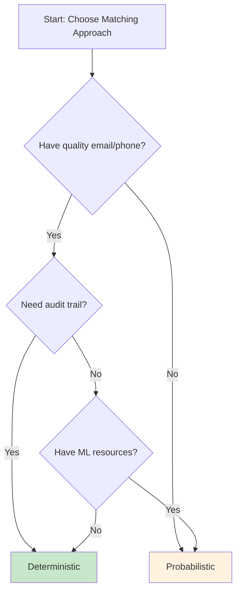

# Deterministic vs Probabilistic Matching

*When to use what for identity resolution*

**Tags:** `identity-resolution` `deterministic-matching` `probabilistic-matching` `data-quality`

**Reading time:** 4 minutes

---

> **TL;DR:** Deterministic matching uses exact identifier matches (email, phone) and is auditable. Probabilistic uses ML for fuzzy matching. Start with deterministic—it handles 60-80% of cases. After working on identity resolution projects, I've found that understanding when to use each approach is critical for success.

In this post, I'll break down both approaches and share my perspective on when each makes sense.

## What is Deterministic Matching?

Deterministic matching relies on exact identifier matches. If two records share the same email address, they belong to the same customer. No algorithms guessing. No confidence scores.

Here's how it works:

1. Extract identifiers from source records (email, phone, loyalty ID)
2. Normalize values (lowercase emails, strip phone formatting)
3. Match records sharing identical identifier values
4. Link matched records into clusters

The matching rule is simple: `IF email_A = email_B THEN same_person`

## What is Probabilistic Matching?

Probabilistic matching uses machine learning or statistical algorithms to calculate the likelihood that two records refer to the same person. It handles fuzzy scenarios:

- "John Smith" vs "Jon Smyth"
- "123 Main Street" vs "123 Main St, Apt 5"
- "McDonald's" vs "McDonalds"

The output includes confidence scores: "85% likely to be the same person."

## My Comparison

| Aspect | Deterministic | Probabilistic |
|--------|---------------|---------------|
| **Accuracy** | High (when identifiers exist) | Variable (depends on training) |
| **Auditability** | Full - can explain every match | Limited - ML black box |
| **Setup Effort** | Low - define identifiers | High - requires training data |
| **Coverage** | Lower - only exact matches | Higher - handles variations |
| **Maintenance** | Minimal | Ongoing model tuning |

## Decision Guide



## When Deterministic Is Enough

In my experience, deterministic matching handles 60-80% of identity resolution use cases. It works well when:

- **You have quality identifiers** - Email, phone, loyalty IDs are reliable
- **Sources are internal** - CRM, transactions, web logins (consistent formatting)
- **Compliance matters** - Need to explain exactly why records matched
- **Resources are limited** - No ML expertise required

## When You Need Probabilistic

Consider probabilistic matching when:

- **Identifiers are unreliable** - Names and addresses are primary data
- **Data is messy** - Typos, abbreviations, format inconsistencies
- **Coverage is critical** - Missing matches has high business cost
- **You have labeled data** - Training examples are available

## My Approach

For [sql-identity-resolution](https://github.com/anilkulkarni87/sql-identity-resolution), I focused on deterministic matching for these reasons:

1. **Transparency** - Every match can be traced to a specific identifier
2. **Simplicity** - No ML infrastructure required
3. **Auditability** - Important for compliance and debugging
4. **Sufficient for many cases** - Email + phone covers most retail scenarios

The system supports canonicalization rules to handle variations:

```sql
-- Rules table supports different canonicalization
INSERT INTO idr_meta.rule VALUES
  ('R_EMAIL', 'Email Match', TRUE, 1, 'EMAIL', 'LOWERCASE', FALSE, TRUE, 10000),
  ('R_PHONE', 'Phone Match', TRUE, 2, 'PHONE', 'NONE', FALSE, TRUE, 10000);
```

## Hybrid Approaches

Some organizations use both:

1. **Start with deterministic** - Match on strong identifiers first
2. **Add probabilistic** - Enhance with fuzzy matching on name/address
3. **Flag for review** - Low-confidence matches go to human review

This is a planned enhancement for the project—adding optional fuzzy matching while keeping deterministic as the foundation.

## Practical Recommendations

Based on my experience:

| If You Have... | Start With... |
|----------------|---------------|
| Email + phone for most records | Deterministic |
| Primarily name/address data | Probabilistic (Zingg, Dedupe) |
| Mix of both | Deterministic first, probabilistic enhancement |
| Compliance requirements | Deterministic |

## Next Steps

In the next post, I'll walk through a complete Snowflake implementation of deterministic identity resolution step by step.

---

*This is post 2 of 8 in the warehouse-native identity resolution series.*

**Next:** [Building Customer 360 in Snowflake with SQL](03_building_customer_360_in_snowflake.md)

If you found this helpful:
- ⭐ Star the [GitHub repo](https://github.com/anilkulkarni87/sql-identity-resolution)
- 📖 Check out [CDP Atlas](https://cdpatlas.vercel.app/) for CDP evaluation tools
- 💬 Questions? [Open an issue](https://github.com/anilkulkarni87/sql-identity-resolution/issues)
