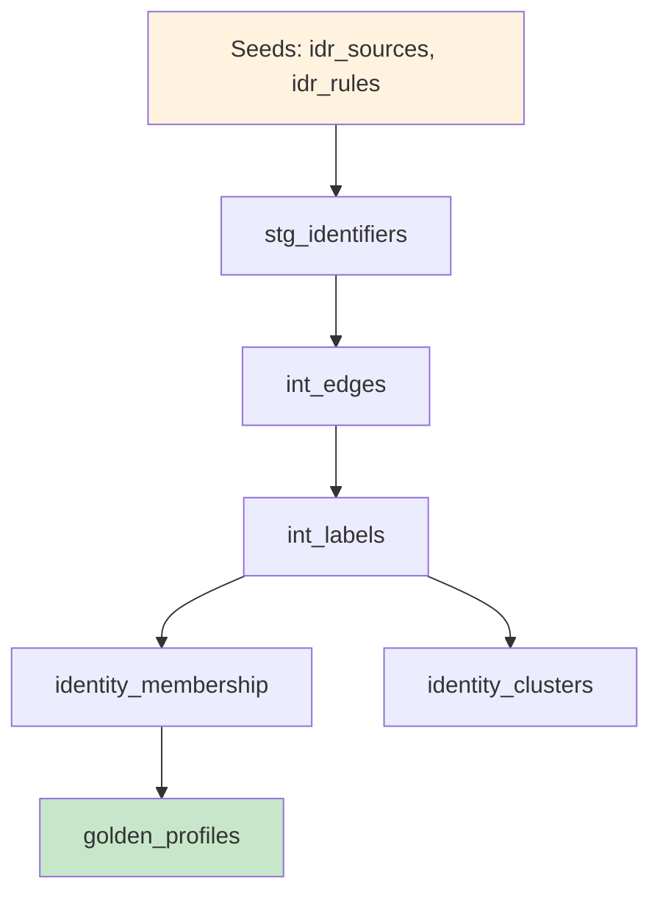

# dbt Integration for Identity Resolution

*Run identity resolution in your existing dbt workflow*

**Tags:** `identity-resolution` `dbt` `dbt-package` `cross-platform` `data-engineering`

**Reading time:** 6 minutes

---

> **TL;DR:** Install the `dbt_idr` package, configure sources via CSV seeds, run `dbt run --select dbt_idr`. Works on Snowflake, BigQuery, Databricks, and DuckDB with identical logic.

After publishing the warehouse-native identity resolution series, the most common question I received was: "Can I run this in dbt?"

The answer is now yes. The `dbt_idr` package brings all the functionality of sql-identity-resolution to your dbt workflow.

## Why dbt?

dbt has become the standard for analytics engineering. If you're already using dbt for your data transformations, adding identity resolution as dbt models makes sense:

| Benefit | Description |
|---------|-------------|
| **Version Control** | Seeds and models are versioned with your project |
| **Cross-Platform** | Same package works on Snowflake, BigQuery, Databricks, DuckDB |
| **Native Integration** | Fits into existing dbt workflows and CI/CD |
| **Dynamic Generation** | SQL auto-generates from seed configuration |

## Installation

Add to your `packages.yml`:

```yaml
packages:
  - git: "https://github.com/anilkulkarni87/sql-identity-resolution"
    subdirectory: "dbt_idr"
    revision: main
```

Install:

```bash
dbt deps
```

## Configuration via Seeds

The dbt package uses CSV seeds for all configuration—no need to modify SQL. Copy the sample seeds to your project:

### idr_sources.csv

```csv
source_id,source_name,database,schema,table_name,entity_key_column,watermark_column,is_active
crm,CRM Customers,ANALYTICS,CRM,customers,customer_id,updated_at,true
orders,Orders,ANALYTICS,ECOM,orders,order_id,order_date,true
```

### idr_rules.csv

```csv
rule_id,identifier_type,priority,is_active,canonicalize,max_group_size
email_exact,EMAIL,1,true,LOWERCASE,10000
phone_exact,PHONE,2,true,NONE,5000
```

### idr_identifier_mappings.csv

```csv
source_id,identifier_type,column_name,is_hashed
crm,EMAIL,email,false
crm,PHONE,phone,false
orders,EMAIL,customer_email,false
```

## Running Identity Resolution

```bash
# Load configuration
dbt seed --select dbt_idr

# Run identity resolution
dbt run --select dbt_idr

# Run tests
dbt test --select dbt_idr
```

That's it. Three commands.

## Model Architecture



The models run in dependency order automatically. dbt handles the DAG.

## Output Models

| Model | Description |
|-------|-------------|
| `identity_membership` | Entity → cluster mapping |
| `identity_clusters` | Cluster metadata with confidence scores |
| `golden_profiles` | Best-record profiles |
| `identity_edges` | Persistent identity edges |
| `run_history` | Execution metadata |
| `stage_metrics` | Row counts per stage |

## Dry Run Mode

Preview changes before committing:

```bash
dbt run --select dbt_idr --vars '{"idr_dry_run": true}'
```

When enabled:
- Models write to preview schemas (`idr_preview_*`)
- `dry_run_results` shows per-entity changes
- `dry_run_summary` provides aggregate statistics

## Cross-Platform Support

The same package works on all four platforms:

| Platform | Notes |
|----------|-------|
| **Snowflake** | Recursive CTE for label propagation |
| **BigQuery** | Iterative 3-pass approach (recursive CTE limitations) |
| **Databricks** | Recursive CTE, Unity Catalog supported |
| **DuckDB** | Recursive CTE, great for local testing |

The package uses dbt's adapter layer and Jinja conditionals to handle platform differences transparently.

## Testing Locally with DuckDB

You can test the entire workflow locally without cloud access:

```bash
pip install dbt-duckdb
cd dbt_idr/integration_tests
./run_tests.sh
```

This creates sample data, runs IDR, and validates results using DuckDB.

## Configuration Variables

Override defaults in your `dbt_project.yml`:

```yaml
vars:
  idr_dry_run: false
  idr_max_lp_iterations: 30
  idr_large_cluster_threshold: 5000
  idr_default_max_group_size: 10000
```

## Comparison: Native SQL vs dbt

| Feature | Native SQL | dbt Package |
|---------|-----------|-------------|
| Configuration | SQL tables | CSV seeds |
| Execution | Stored procedures | `dbt run` |
| Scheduling | Platform schedulers | dbt Cloud / Airflow |
| Version Control | Manual | Git-native |
| Cross-Platform | Platform-specific files | Single package |

## Integration with CDP Atlas

If you're designing your CDP architecture, the [CDP Atlas Visual Builder](https://cdpatlas.vercel.app/builder) can help you map where identity resolution fits in your stack.

## My Recommendation

If you're already using dbt, the dbt package is the right choice:

1. **Configuration as code** - Seeds are version controlled
2. **CI/CD ready** - Runs in dbt Cloud, Airflow, GitHub Actions
3. **Cross-platform** - One codebase, four warehouses
4. **Community standard** - dbt is the analytics engineering standard

If you're not using dbt, the native SQL approach still works great.

## Getting Started

1. Add package to `packages.yml`
2. Copy sample seeds to your project
3. Modify seeds for your sources
4. Run `dbt seed && dbt run --select dbt_idr`
5. Query `identity_membership` and `golden_profiles`

Full documentation: [dbt Package Guide](https://anilkulkarni87.github.io/sql-identity-resolution/guides/dbt-package/)

---

*This is a bonus post in the warehouse-native identity resolution series, covering the new dbt integration.*

If you found this helpful:
- ⭐ Star the [GitHub repo](https://github.com/anilkulkarni87/sql-identity-resolution)
- 📖 Check out [CDP Atlas](https://cdpatlas.vercel.app/) for CDP evaluation tools
- 💬 Questions? [Open an issue](https://github.com/anilkulkarni87/sql-identity-resolution/issues)
