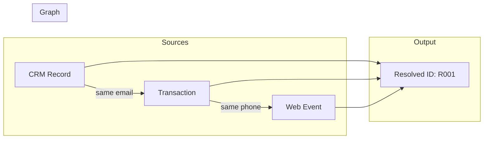
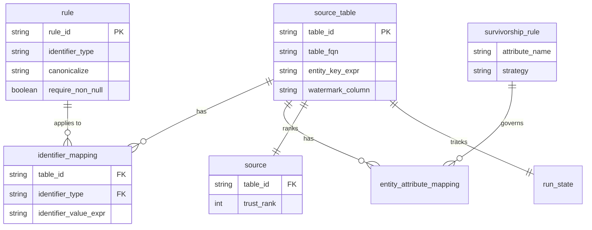
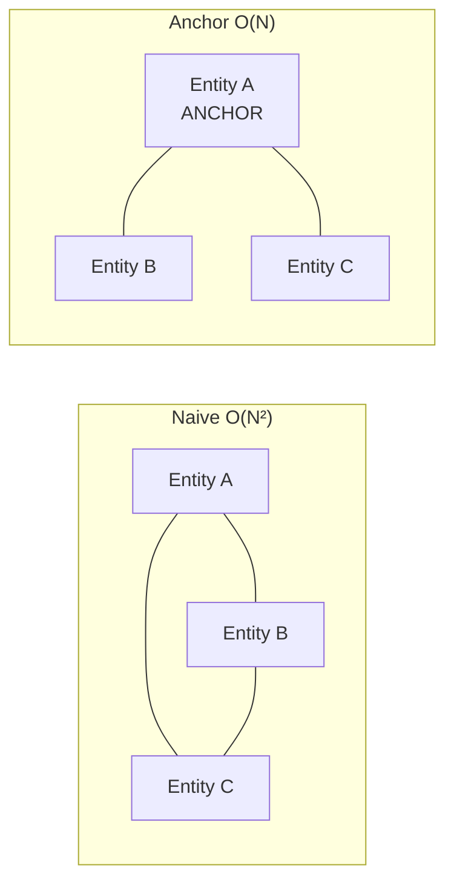
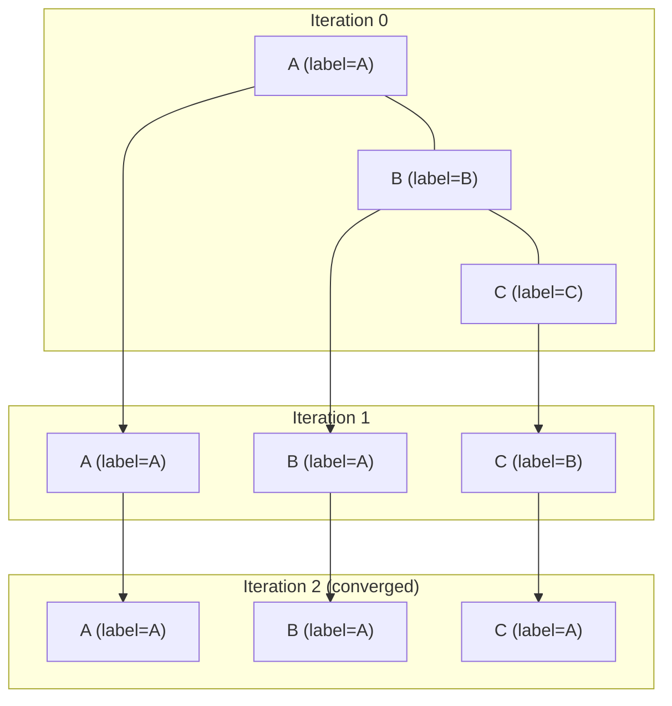
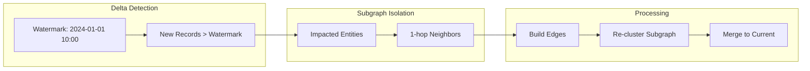
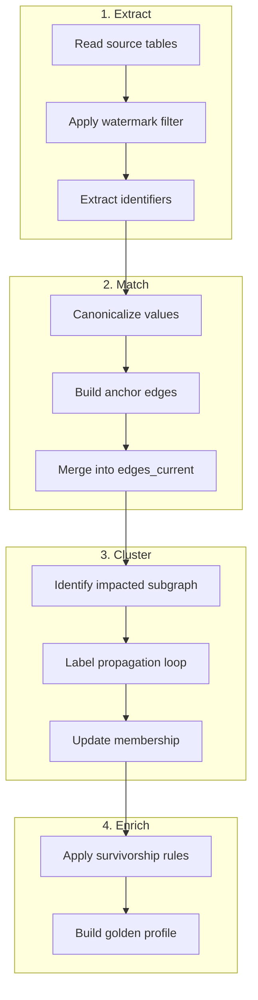

# Architecture

This document explains the core concepts, data model, and algorithms powering sql-identity-resolution.

## Overview

Identity resolution creates a **unified view of customers** by linking records from multiple sources (CRM, transactions, web events) that represent the same person. This system uses a **deterministic, graph-based approach**:

1. Records become **nodes** (entities)
2. Shared identifiers create **edges** between nodes
3. Connected components become **clusters** (resolved identities)
4. **Survivorship rules** select the best values for the golden profile



---

## Data Model

### Core Concepts

| Concept | Description | Example |
|---------|-------------|---------|
| **Entity** | A single record from a source table | CRM customer row |
| **Entity Key** | Unique identifier: `{table_id}:{primary_key}` | `customer:C000123` |
| **Identifier** | A value used for matching (email, phone, etc.) | `john@example.com` |
| **Edge** | Link between two entities sharing an identifier | `customer:C001 ↔ txn:T999` |
| **Resolved ID** | Cluster identifier for linked entities | `customer:C001` (anchor) |
| **Golden Profile** | Best values for a resolved identity | Most trusted email, name |

### Metadata Tables (`idr_meta.*`)



### How Rules Work

Rules define **how identifiers are matched** between entities. Each rule specifies an identifier type and how to normalize it.

**Rule execution**: All active rules run in parallel during edge building. The `priority` column is used for tie-breaking when multiple rules could apply.

#### Example: Rule Table

| rule_id | priority | identifier_type | canonicalize | require_non_null |
|---------|----------|-----------------|--------------|------------------|
| R_EMAIL_EXACT | 1 | EMAIL | LOWERCASE | true |
| R_PHONE_EXACT | 2 | PHONE | PHONE_DIGITS | true |
| R_LOYALTY_EXACT | 3 | LOYALTY_ID | NONE | true |

#### Canonicalize Options

The `canonicalize` column determines how identifier values are normalized before comparison:

| Option | Effect | Input → Output |
|--------|--------|----------------|
| `LOWERCASE` | Convert to lowercase | `John@Gmail.COM` → `john@gmail.com` |
| `UPPERCASE` | Convert to uppercase | `john@gmail.com` → `JOHN@GMAIL.COM` |
| `NONE` | No transformation | `L123456` → `L123456` |
| `TRIM` | Remove whitespace | `" 9876543210 "` → `9876543210` |
| `PHONE_DIGITS` | Keep only digits | `+1 (987) 654-3210` → `19876543210` |

#### Example: How Canonicalization Creates Matches

**Without canonicalization** (NONE):
```
CRM:  email = "John.Doe@Gmail.com"
Web:  email = "JOHN.DOE@GMAIL.COM"
→ NO MATCH (different strings)
```

**With canonicalization** (LOWERCASE):
```
CRM:  email = "John.Doe@Gmail.com"  → "john.doe@gmail.com"
Web:  email = "JOHN.DOE@GMAIL.COM"  → "john.doe@gmail.com"
→ MATCH! (same normalized value)
```

#### Rule Priority

Lower `priority` = higher importance. When the same pair of entities could be matched by multiple rules, the lower priority rule's edge is kept.

```
Priority 1 (EMAIL)  → Most trusted match type
Priority 2 (PHONE)  → Secondary match type  
Priority 3 (LOYALTY_ID) → Tertiary match type
```

### Output Tables (`idr_out.*`)

| Table | Purpose | Key Columns |
|-------|---------|-------------|
| `identity_edges_current` | All identity links | `left_entity_key`, `right_entity_key`, `identifier_value_norm` |
| `identity_resolved_membership_current` | Entity → Cluster mapping | `entity_key`, `resolved_id` |
| `identity_clusters_current` | Cluster statistics | `resolved_id`, `cluster_size` |
| `golden_profile_current` | Best attributes per identity | `resolved_id`, `email_primary`, `first_name` |

---

## Algorithms

### 1. Anchor-Based Edge Building

**Problem**: If N entities share the same email, a naive approach creates N×(N-1)/2 edges — **O(N²)** — which explodes at scale.

**Solution**: Use an **anchor node** (lexicographically smallest entity_key) and connect all others to it — **O(N)** edges.



**Why this works**: Connected component detection (clustering) only needs *transitivity*, not all-pairs connectivity. A→B and A→C implies B and C are in the same cluster.

**Implementation** ([20_build_edges_incremental.sql](file:///Users/a.kulkarni/Documents/GitHub/sql-identity-resolution/sql/common/20_build_edges_incremental.sql)):
```sql
-- Choose anchor per identifier group
SELECT identifier_value_norm, MIN(entity_key) AS anchor_entity_key
FROM identifiers
GROUP BY identifier_value_norm

-- Build edges from anchor to all others
SELECT anchor AS left_entity_key, entity_key AS right_entity_key
WHERE entity_key <> anchor
```

### 2. Label Propagation Clustering

**Problem**: Find connected components (clusters) in a graph—pure SQL, no external libraries.

**Solution**: Iterative label propagation where each node adopts the minimum label among itself and neighbors.



**Convergence**: Algorithm terminates when `delta_changed = 0` (no node changed labels).

**Worst case**: O(diameter) iterations. For identity graphs, typically 3-10 iterations.

**Implementation** ([31_label_propagation_step.sql](file:///Users/a.kulkarni/Documents/GitHub/sql-identity-resolution/sql/common/31_label_propagation_step.sql)):
```sql
-- One iteration: each node takes MIN of self + neighbor labels
SELECT entity_key, MIN(candidate_label) AS label
FROM (
  SELECT entity_key, label AS candidate_label FROM labels
  UNION ALL
  SELECT edge.src, neighbor.label FROM edges JOIN labels neighbor ON ...
)
GROUP BY entity_key
```

### 3. Understanding `resolved_id`

> **Key Design Decision**: The `resolved_id` is the **minimum `entity_key`** in each cluster—not a synthetic UUID.

**What you'll see:**
```
entity_key           | resolved_id
---------------------|-------------------
customer:C000003     | customer:C000003  ← anchor (min)
transaction:T000999  | customer:C000003  ← linked to anchor
web_event:E001234    | customer:C000003  ← linked to anchor
```

**Why this design?**

| Benefit | Explanation |
|---------|-------------|
| **Deterministic** | Same data always produces same `resolved_id` |
| **Persistent** | Won't change between runs (unlike random UUIDs) |
| **Traceable** | You can identify which entity "anchored" the cluster |
| **Simple** | No sequence generators, no lookup tables, no coordination |
| **Incremental-safe** | New entities join existing clusters seamlessly |

**Singletons**: Entities with no matching identifiers have `resolved_id = entity_key` (they're their own cluster).

**Alternative approaches** (not implemented):
- Hash-based: `MD5(MIN(entity_key))` — deterministic but less traceable
- Lookup table: Assign UUIDs on first encounter — requires state management

### 4. Incremental Processing

**Problem**: Re-processing millions of rows on every run is expensive.

**Solution**: Watermark-based delta detection + subgraph isolation.



**Key insight**: Only re-cluster the **impacted subgraph** (changed entities + their neighbors), not the entire graph.

### 4. Survivorship (Golden Profile)

**Problem**: Multiple sources have conflicting values (different emails, names). Which wins?

**Solution**: Configurable strategies per attribute:

| Strategy | Logic |
|----------|-------|
| `SOURCE_PRIORITY` | Prefer higher-ranked source (CRM > Web) |
| `MOST_RECENT` | Use most recently updated value |
| `SOURCE_PRIORITY + MOST_RECENT` | Rank first, then recency as tiebreaker |

**Implementation**: Correlated subqueries with ORDER BY + LIMIT 1.

---

## Processing Pipeline



---

## Why Deterministic?

This system is **fully deterministic**:

- ✅ Same input data → Same edges
- ✅ Same edges → Same clusters (MIN label is unique)
- ✅ Same clusters → Same golden profiles (deterministic ordering)

**Benefits**:
- Auditable and reproducible results
- Easier debugging and testing
- No model drift or training data dependency

---

## Further Reading

- [Scale Considerations](scale_considerations.md) — Performance at 1M, 10M, 100M rows
- [Runbook](runbook.md) — Operational guide