# Architecture

This document describes the system architecture of SQL Identity Resolution.

---

## High-Level Architecture

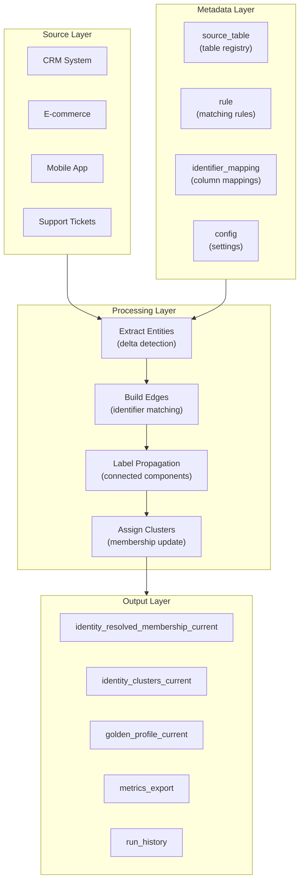

---

## Cross-Platform Design

The same core logic runs on all platforms with platform-specific adapters:

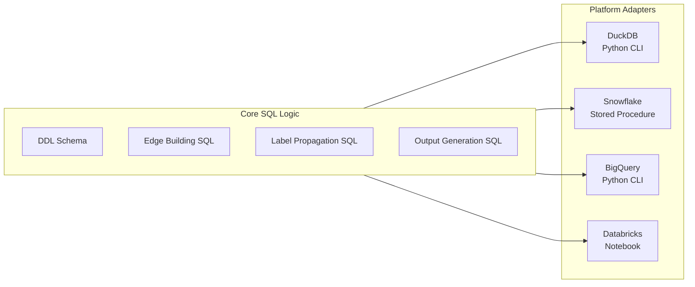

---

## Data Flow

### 1. Input Processing

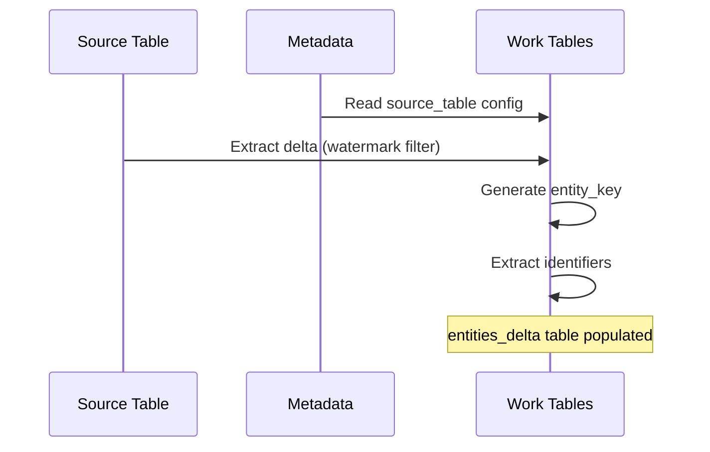

### 2. Edge Building

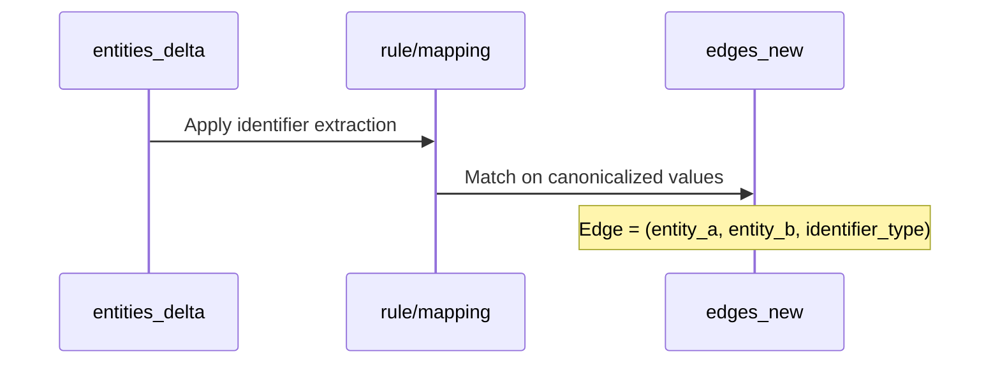

### 3. Label Propagation

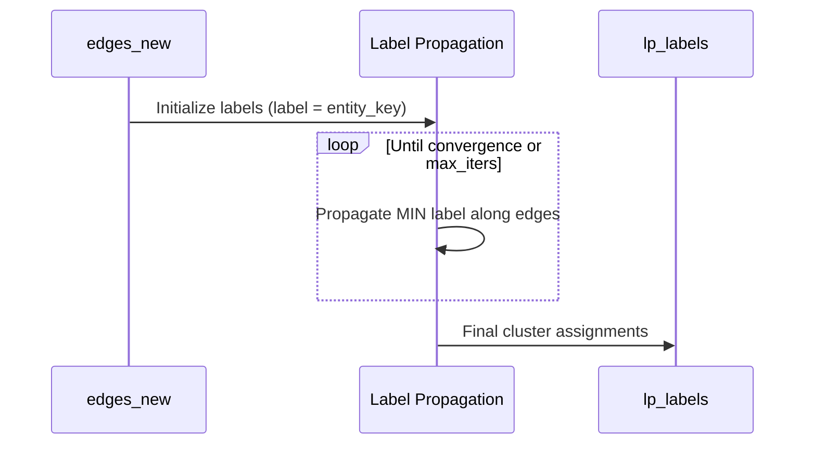

### 4. Output Generation

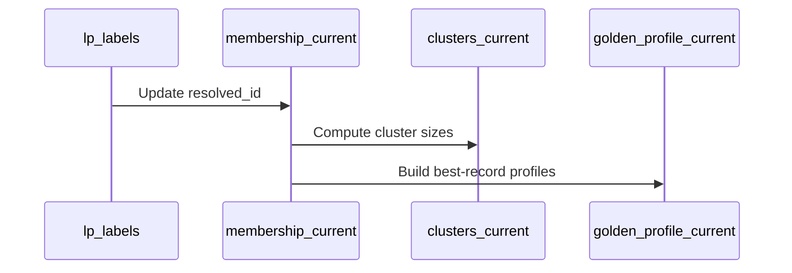

---

## Schema Design

### idr_meta (Configuration)

| Table | Purpose |
|-------|---------|
| `source_table` | Registry of source tables to process |
| `rule` | Matching rules with priority and limits |
| `identifier_mapping` | Maps source columns to identifier types |
| `run_state` | Watermark tracking per source |
| `config` | Key-value configuration settings |
| `identifier_exclusion` | Values to exclude from matching |

### idr_work (Processing)

| Table | Purpose | Lifecycle |
|-------|---------|-----------|
| `entities_delta` | Entities to process this run | Per-run |
| `identifiers` | Extracted identifier values | Per-run |
| `edges_new` | Entity pairs with matching identifiers | Per-run |
| `lp_labels` | Label propagation results | Per-run |
| `membership_updates` | Proposed membership changes | Per-run |

### idr_out (Output)

| Table | Purpose |
|-------|---------|
| `identity_resolved_membership_current` | Entity → Cluster mapping |
| `identity_clusters_current` | Cluster metadata (size, confidence_score, edge_diversity, match_density, primary_reason) |
| `golden_profile_current` | Best-record profiles per cluster |
| `run_history` | Audit log of all runs |
| `stage_metrics` | Per-stage timing metrics |
| `metrics_export` | Exportable metrics |
| `dry_run_results` | Per-entity dry run changes |
| `dry_run_summary` | Aggregate dry run statistics |
| `skipped_identifier_groups` | Audit of skipped groups |

---

## Processing Modes

### Full Mode

Processes all entities from all source tables:

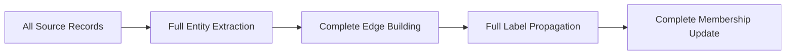

### Incremental Mode

Processes only changed entities (watermark-based):

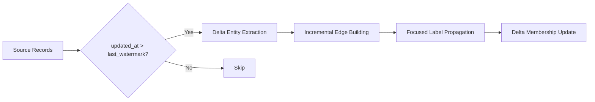

---

## Dry Run Architecture

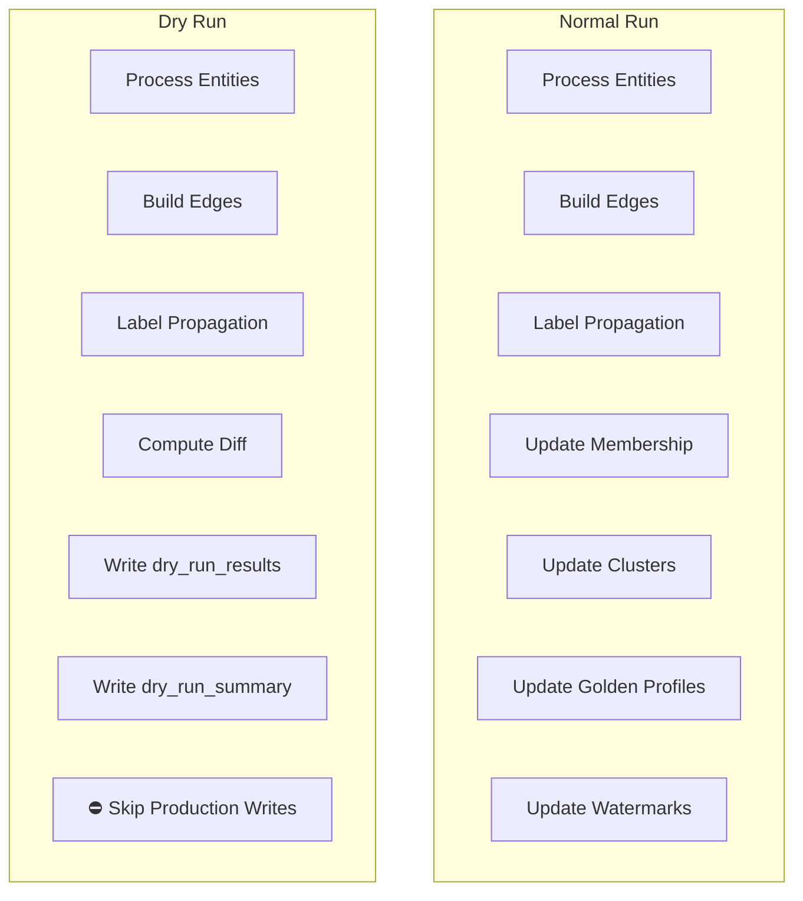

---

## Metrics Export Architecture

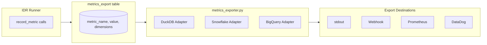

---

## Security Model

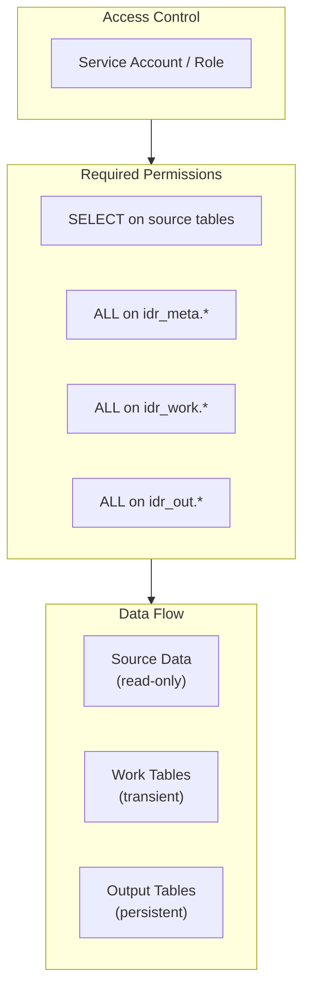

---

## Next Steps

- [Matching Algorithm](matching-algorithm.md) - Deep dive into label propagation
- [Data Model](data-model.md) - Complete schema reference
- [Configuration](../guides/configuration.md) - Setting up rules and sources
