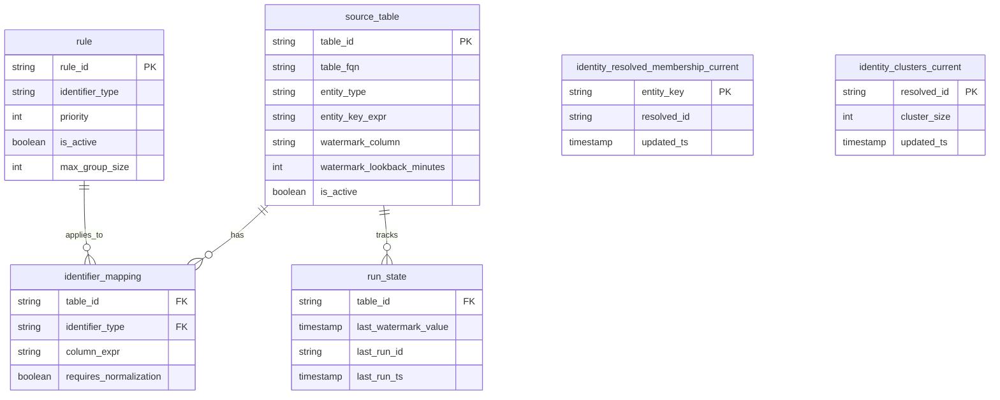

# Data Model

Complete reference for all tables in SQL Identity Resolution.

---

## Schema Overview



---

## idr_meta Schema

### source_table

Registry of source tables to process.

| Column | Type | Description |
|--------|------|-------------|
| `table_id` | VARCHAR | **PK** Unique identifier for this source |
| `table_fqn` | VARCHAR | Fully qualified table name |
| `entity_type` | VARCHAR | Entity type (e.g., PERSON, ACCOUNT) |
| `entity_key_expr` | VARCHAR | SQL expression for entity key |
| `watermark_column` | VARCHAR | Column for incremental processing |
| `watermark_lookback_minutes` | INT | Lookback buffer for late-arriving data |
| `is_active` | BOOLEAN | Include in processing |

**Example:**
```sql
INSERT INTO idr_meta.source_table VALUES
  ('customers', 'crm.customers', 'PERSON', 'customer_id', 'updated_at', 0, TRUE),
  ('orders', 'ecom.orders', 'PERSON', 'user_id', 'order_date', 60, TRUE);
```

---

### rule

Matching rules defining how identifiers are used.

| Column | Type | Description |
|--------|------|-------------|
| `rule_id` | VARCHAR | **PK** Unique rule identifier |
| `identifier_type` | VARCHAR | Type of identifier (EMAIL, PHONE, etc.) |
| `priority` | INT | Processing priority (lower = higher priority) |
| `is_active` | BOOLEAN | Include in processing |
| `max_group_size` | INT | Max entities per identifier group |

**Example:**
```sql
INSERT INTO idr_meta.rule VALUES
  ('email_exact', 'EMAIL', 1, TRUE, 10000),
  ('phone_exact', 'PHONE', 2, TRUE, 5000),
  ('loyalty_id', 'LOYALTY', 3, TRUE, 1);
```

---

### identifier_mapping

Maps source columns to identifier types.

| Column | Type | Description |
|--------|------|-------------|
| `table_id` | VARCHAR | **FK** → source_table |
| `identifier_type` | VARCHAR | Type of identifier |
| `column_expr` | VARCHAR | SQL expression to extract identifier |
| `requires_normalization` | BOOLEAN | Apply normalization (lowercase, etc.) |

**Example:**
```sql
INSERT INTO idr_meta.identifier_mapping VALUES
  ('customers', 'EMAIL', 'email', TRUE),
  ('customers', 'PHONE', 'phone', TRUE),
  ('orders', 'EMAIL', 'customer_email', TRUE);
```

---

### run_state

Tracks watermarks for incremental processing.

| Column | Type | Description |
|--------|------|-------------|
| `table_id` | VARCHAR | **FK** → source_table |
| `last_watermark_value` | TIMESTAMP | Last processed watermark |
| `last_run_id` | VARCHAR | ID of last run |
| `last_run_ts` | TIMESTAMP | Timestamp of last run |

---

### config

Key-value configuration settings.

| Column | Type | Description |
|--------|------|-------------|
| `config_key` | VARCHAR | **PK** Configuration key |
| `config_value` | VARCHAR | Configuration value |
| `description` | VARCHAR | Human-readable description |
| `updated_at` | TIMESTAMP | Last update time |

**Default values:**
```sql
INSERT INTO idr_meta.config VALUES
  ('dry_run_retention_days', '7', 'Days to retain dry run results', NOW()),
  ('large_cluster_threshold', '5000', 'Threshold for large cluster warnings', NOW());
```

---

### identifier_exclusion

Values to exclude from matching.

| Column | Type | Description |
|--------|------|-------------|
| `identifier_type` | VARCHAR | Type of identifier |
| `identifier_pattern` | VARCHAR | Value or pattern to exclude |
| `is_pattern` | BOOLEAN | TRUE if LIKE pattern |
| `reason` | VARCHAR | Reason for exclusion |

**Example:**
```sql
INSERT INTO idr_meta.identifier_exclusion VALUES
  ('EMAIL', 'test@test.com', FALSE, 'Generic test email'),
  ('EMAIL', '%@example.com', TRUE, 'Example domain'),
  ('PHONE', '0000000000', FALSE, 'Invalid phone');
```

---

## idr_out Schema

### identity_resolved_membership_current

Maps each entity to its resolved identity.

| Column | Type | Description |
|--------|------|-------------|
| `entity_key` | VARCHAR | **PK** Unique entity identifier |
| `resolved_id` | VARCHAR | Cluster identifier (= entity_key of cluster anchor) |
| `updated_ts` | TIMESTAMP | Last update time |

---

### identity_clusters_current

Cluster metadata.

| Column | Type | Description |
|--------|------|-------------|
| `resolved_id` | VARCHAR | **PK** Cluster identifier |
| `cluster_size` | INT | Number of entities in cluster |
| `updated_ts` | TIMESTAMP | Last update time |

---

### golden_profile_current

Best-record golden profiles per cluster.

| Column | Type | Description |
|--------|------|-------------|
| `resolved_id` | VARCHAR | **PK** Cluster identifier |
| `email_primary` | VARCHAR | Best email |
| `phone_primary` | VARCHAR | Best phone |
| `first_name` | VARCHAR | Best first name |
| `last_name` | VARCHAR | Best last name |
| `updated_ts` | TIMESTAMP | Last update time |

---

### run_history

Audit log of all runs.

| Column | Type | Description |
|--------|------|-------------|
| `run_id` | VARCHAR | **PK** Unique run identifier |
| `run_mode` | VARCHAR | FULL or INCR |
| `started_at` | TIMESTAMP | Run start time |
| `ended_at` | TIMESTAMP | Run end time |
| `status` | VARCHAR | SUCCESS, SUCCESS_WITH_WARNINGS, FAILED, DRY_RUN_COMPLETE |
| `entities_processed` | INT | Number of entities processed |
| `edges_created` | INT | Number of edges created |
| `clusters_impacted` | INT | Number of clusters affected |
| `lp_iterations` | INT | Label propagation iterations |
| `duration_seconds` | INT | Total duration |
| `groups_skipped` | INT | Groups skipped (max_group_size) |
| `values_excluded` | INT | Values excluded (exclusion list) |
| `large_clusters` | INT | Clusters above threshold |
| `warnings` | VARCHAR | JSON array of warnings |

---

### dry_run_results

Per-entity changes from dry run.

| Column | Type | Description |
|--------|------|-------------|
| `run_id` | VARCHAR | Dry run identifier |
| `entity_key` | VARCHAR | Entity identifier |
| `current_resolved_id` | VARCHAR | Current cluster (NULL if new) |
| `proposed_resolved_id` | VARCHAR | Proposed cluster |
| `change_type` | VARCHAR | NEW, MOVED, UNCHANGED |
| `current_cluster_size` | INT | Current cluster size |
| `proposed_cluster_size` | INT | Proposed cluster size |
| `created_at` | TIMESTAMP | Record creation time |

---

### dry_run_summary

Aggregate dry run statistics.

| Column | Type | Description |
|--------|------|-------------|
| `run_id` | VARCHAR | **PK** Dry run identifier |
| `total_entities` | INT | Total entities analyzed |
| `new_entities` | INT | Entities with NEW change type |
| `moved_entities` | INT | Entities with MOVED change type |
| `unchanged_entities` | INT | Entities with UNCHANGED change type |
| `merged_clusters` | INT | Clusters that would merge |
| `split_clusters` | INT | Clusters that would split |
| `largest_proposed_cluster` | INT | Size of largest proposed cluster |
| `edges_would_create` | INT | Edges that would be created |
| `groups_would_skip` | INT | Groups that would be skipped |
| `values_would_exclude` | INT | Values that would be excluded |
| `execution_time_seconds` | INT | Processing time |
| `created_at` | TIMESTAMP | Record creation time |

---

### metrics_export

Exportable metrics for monitoring.

| Column | Type | Description |
|--------|------|-------------|
| `metric_id` | VARCHAR | **PK** Unique metric ID |
| `run_id` | VARCHAR | Associated run ID |
| `metric_name` | VARCHAR | Metric name |
| `metric_value` | DOUBLE | Metric value |
| `metric_type` | VARCHAR | gauge, counter |
| `dimensions` | VARCHAR | JSON dimensions |
| `recorded_at` | TIMESTAMP | Recording time |
| `exported_at` | TIMESTAMP | Export time (NULL if not exported) |

---

### skipped_identifier_groups

Audit log of skipped identifier groups.

| Column | Type | Description |
|--------|------|-------------|
| `run_id` | VARCHAR | Run identifier |
| `identifier_type` | VARCHAR | Type of identifier |
| `identifier_value_norm` | VARCHAR | Normalized identifier value |
| `group_size` | INT | Size of skipped group |
| `max_allowed` | INT | Configured max_group_size |
| `sample_entity_keys` | VARCHAR | Sample of affected entity keys |
| `reason` | VARCHAR | Reason for skip |
| `skipped_at` | TIMESTAMP | Skip time |

---

## Next Steps

- [Configuration Guide](../guides/configuration.md)
- [Architecture](architecture.md)
- [Schema Reference](../reference/schema-reference.md) - Full DDL
