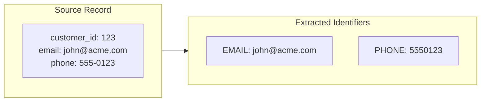
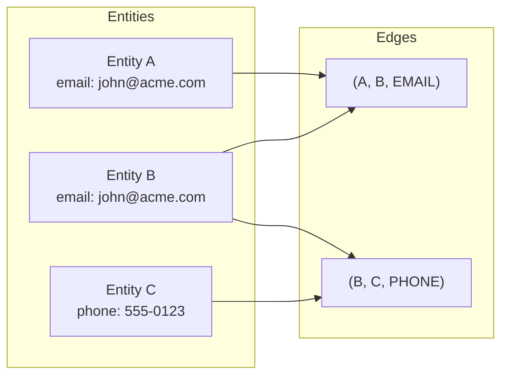
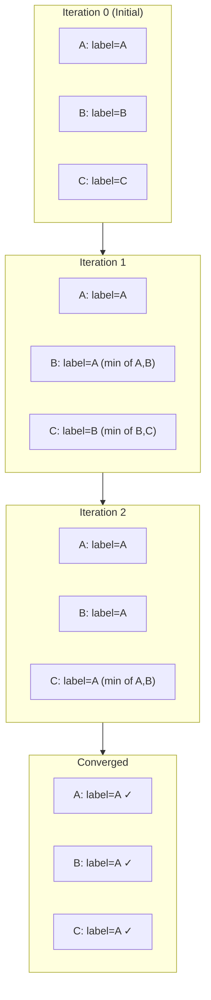
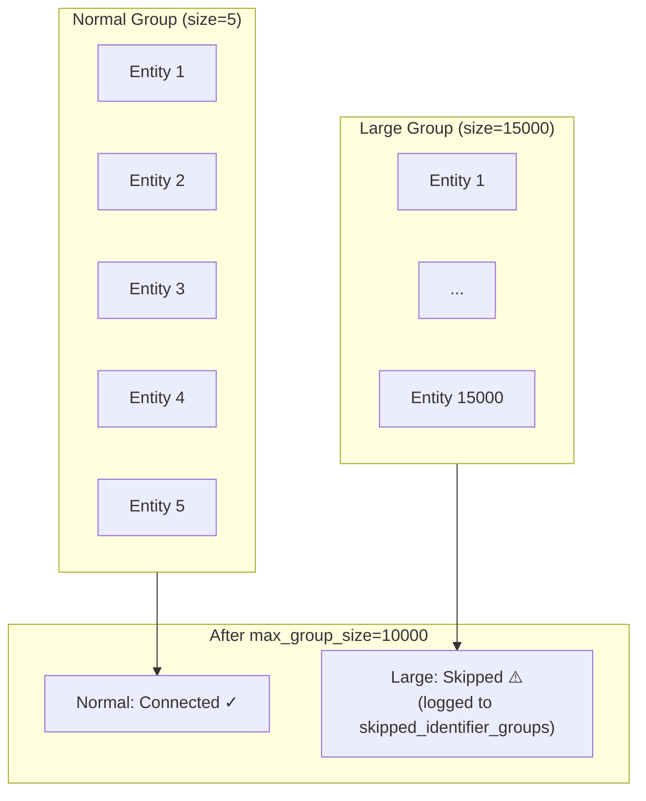
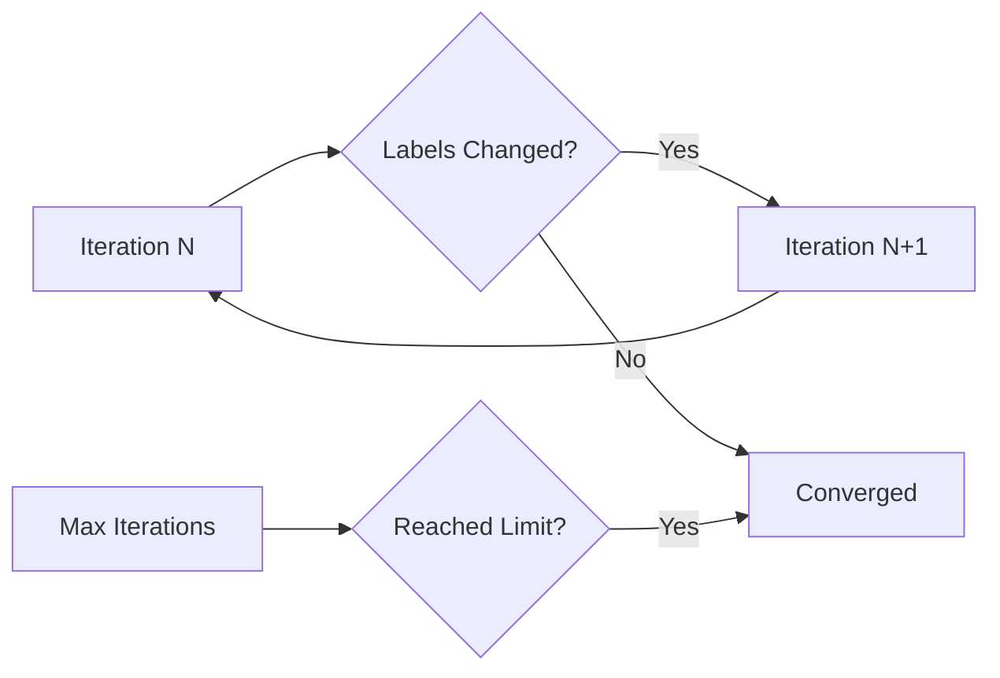

# Matching Algorithm

This document explains the deterministic matching algorithm used in SQL Identity Resolution.

---

## Overview

The algorithm uses **Label Propagation** on a graph of entities connected by shared identifiers. This is a form of **connected components** detection that assigns all entities in a connected subgraph to the same cluster.

---

## Algorithm Steps

### Step 1: Identifier Extraction

Extract identifiers from source entities based on mapping rules:



**Normalization rules:**
- Email: lowercase, trim whitespace
- Phone: digits only
- Custom: configurable per identifier type

### Step 2: Edge Building

Create edges between entities that share an identifier:



**SQL Logic:**
```sql
-- Create edges from shared identifiers
INSERT INTO idr_work.edges_new
SELECT 
    a.entity_key AS entity_a,
    b.entity_key AS entity_b,
    a.identifier_type
FROM idr_work.identifiers a
JOIN idr_work.identifiers b 
    ON a.identifier_type = b.identifier_type
    AND a.identifier_value_norm = b.identifier_value_norm
    AND a.entity_key < b.entity_key  -- Avoid duplicates
```

### Step 3: Label Propagation

Iteratively propagate the minimum label along edges until convergence:



**SQL Logic (one iteration):**
```sql
-- Propagate minimum label along edges
UPDATE idr_work.lp_labels curr
SET label = (
    SELECT MIN(neighbor.label)
    FROM idr_work.edges_new e
    JOIN idr_work.lp_labels neighbor
        ON neighbor.entity_key = CASE
            WHEN e.entity_a = curr.entity_key THEN e.entity_b
            ELSE e.entity_a
        END
    WHERE e.entity_a = curr.entity_key OR e.entity_b = curr.entity_key
)
WHERE EXISTS (
    SELECT 1 FROM idr_work.edges_new e
    WHERE e.entity_a = curr.entity_key OR e.entity_b = curr.entity_key
);
```

### Step 4: Cluster Assignment

The final label becomes the `resolved_id`:

| entity_key | label (resolved_id) |
|------------|---------------------|
| customer:A | customer:A |
| customer:B | customer:A |
| customer:C | customer:A |
| customer:D | customer:D |

---

## Handling Edge Cases

### Singletons

Entities with no matching identifiers get `resolved_id = entity_key`:

```sql
-- Singletons: entities with no edges
INSERT INTO idr_work.membership_updates
SELECT entity_key, entity_key AS resolved_id
FROM idr_work.entities_delta
WHERE entity_key NOT IN (
    SELECT entity_key FROM idr_work.lp_labels
);
```

### Large Groups (max_group_size)

To prevent generic identifiers (e.g., `test@test.com`) from creating mega-clusters:



**Configuration:**
```sql
INSERT INTO idr_meta.rule (rule_id, identifier_type, max_group_size)
VALUES ('email_exact', 'EMAIL', 10000);
```

### Identifier Exclusions

Skip known bad identifiers:

```sql
INSERT INTO idr_meta.identifier_exclusion
VALUES ('EMAIL', 'test@test.com', FALSE, 'Generic test email');

INSERT INTO idr_meta.identifier_exclusion
VALUES ('EMAIL', '%@example.com', TRUE, 'Example domain pattern');
```

---

## Convergence

The algorithm converges when no labels change between iterations:



**Typical convergence:**
- Small graphs: 2-5 iterations
- Medium graphs: 5-10 iterations
- Large graphs: 10-20 iterations
- Max default: 30 iterations

---

## Complexity Analysis

| Step | Time Complexity | Space Complexity |
|------|-----------------|------------------|
| Identifier Extraction | O(n) | O(n × m) |
| Edge Building | O(n × m) | O(e) |
| Label Propagation | O(i × e) | O(n) |
| Cluster Assignment | O(n) | O(n) |

Where:
- n = number of entities
- m = avg identifiers per entity
- e = number of edges
- i = iterations until convergence

---

## Comparison with Other Algorithms

| Algorithm | Pros | Cons |
|-----------|------|------|
| **Label Propagation** (this) | Simple, deterministic, SQL-native | May not handle probabilistic matches |
| **Union-Find** | Faster for sparse graphs | Harder to implement in SQL |
| **ML-based (Dedupe)** | Handles fuzzy matches | Requires training, black box |
| **Fellegi-Sunter** | Statistical rigor | Complex, requires tuning |

---

## Next Steps

- [Data Model](data-model.md) - Schema reference
- [Configuration](../guides/configuration.md) - Setting up rules
- [Production Hardening](../guides/production-hardening.md) - max_group_size, exclusions
