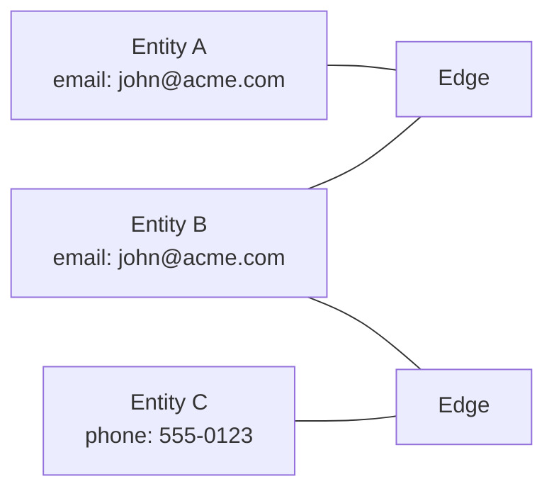
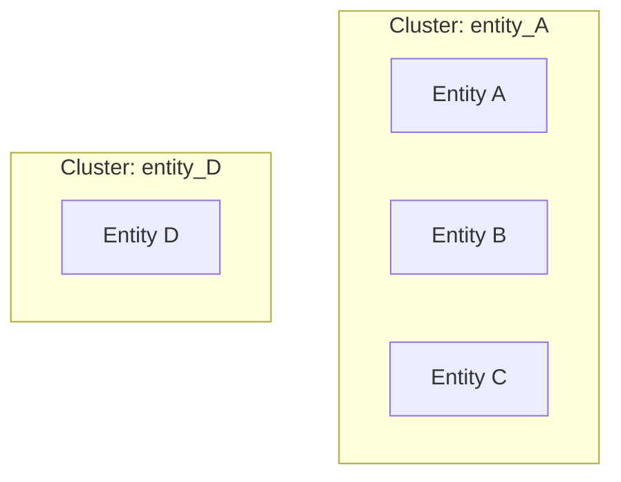

---
tags:
  - overview
  - introduction
  - concepts
---

# Overview

## What is SQL Identity Resolution?

SQL Identity Resolution (IDR) is a **deterministic identity resolution engine** that runs entirely within your data warehouse. It matches and clusters entities across multiple source systems to create a unified view of each identity.

### Key Differentiators

| Aspect | Traditional IDR | SQL Identity Resolution |
|--------|-----------------|------------------------|
| **Execution** | External SaaS | Your data warehouse |
| **Data Movement** | Data leaves your infra | Data stays in place |
| **Matching** | ML black box | Transparent SQL rules |
| **Cost** | $60K-$480K/year | Free (open source) |
| **Platforms** | Vendor-specific | DuckDB, Snowflake, BigQuery, Databricks |

---

## How It Works

### 1. Configure Sources & Rules

Define your source tables and matching rules in metadata tables:

```sql
-- Register a source table
INSERT INTO idr_meta.source_table VALUES
  ('customers', 'crm.customers', 'PERSON', 'customer_id', 'updated_at', 0, TRUE);

-- Define matching rules
INSERT INTO idr_meta.rule VALUES
  ('email_exact', 'EMAIL', 1, TRUE, 10000);
```

### 2. Build Identity Graph

The engine extracts identifiers and builds edges between entities:



### 3. Label Propagation

Connected components algorithm assigns cluster labels:



### 4. Generate Outputs

- **Membership Table**: Maps each entity to its resolved_id
- **Clusters Table**: Cluster sizes and metadata
- **Golden Profiles**: Best-record selection per cluster

---

## Supported Platforms

| Platform | Runner Type | Dry Run | Metrics |
|----------|-------------|---------|---------|
| **DuckDB** | Python CLI | ✅ `--dry-run` | ✅ |
| **Snowflake** | Stored Procedure | ✅ 3rd parameter | ✅ |
| **BigQuery** | Python CLI | ✅ `--dry-run` | ✅ |
| **Databricks** | Notebook | ✅ Widget | ✅ |

---

## Use Cases

### Customer Data Unification
Merge customer records from CRM, e-commerce, support tickets, and mobile apps into a single customer view.

### Household Identification
Group individuals into households using address matching and relationship detection.

### Account Deduplication
Identify and merge duplicate business accounts across sales and marketing systems.

### Fraud Detection
Detect when multiple accounts share identifiers that shouldn't be shared.

---

## Next Steps

- [Quick Start](quickstart.md) - Get running in 5 minutes
- [Architecture](../concepts/architecture.md) - Understand the system design
- [Platform Setup](platforms/duckdb.md) - Detailed setup guides
