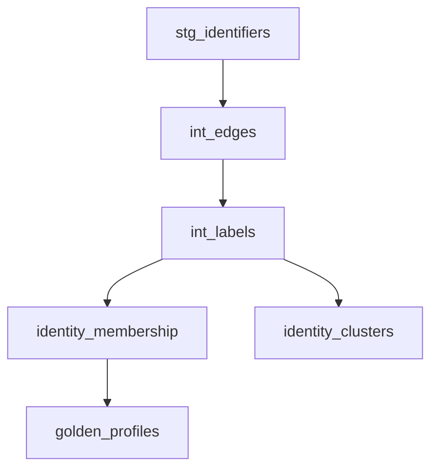

# dbt Package Guide

The `dbt_idr` package brings SQL Identity Resolution to your dbt workflow. It provides the same functionality as the platform-specific implementations but integrates natively with dbt's model-based approach.

## Why dbt?

- **Version Control** - Seeds and models are versioned with your project
- **Cross-Platform** - Same package works on Snowflake, BigQuery, Databricks, DuckDB
- **Native Integration** - Fits into existing dbt workflows and CI/CD
- **Dynamic Generation** - SQL auto-generates from seed configuration

## Installation

Add to your `packages.yml`:

```yaml
packages:
  - git: "https://github.com/anilkulkarni87/sql-identity-resolution"
    subdirectory: "dbt_idr"
    revision: main
```

Install dependencies:

```bash
dbt deps
```

## Configuration

The dbt package uses **seeds** for all configuration. No code changes needed - just update CSVs.

### Required Seeds

| Seed | Purpose |
|------|---------|
| `idr_sources.csv` | Register your source tables |
| `idr_identifier_mappings.csv` | Map columns to identifier types |
| `idr_rules.csv` | Define matching rules |
| `idr_exclusions.csv` | Exclude invalid identifiers |
| `idr_attribute_mappings.csv` | Map columns for golden profiles |
| `idr_survivorship_rules.csv` | How to pick winning values |

### Example: idr_sources.csv

```csv
source_id,source_name,database,schema,table_name,entity_key_column,watermark_column,is_active
crm,CRM Customers,ANALYTICS,CRM,customers,customer_id,updated_at,true
orders,Orders,ANALYTICS,ECOM,orders,order_id,order_date,true
```

!!! note "DuckDB"
    Leave `database` empty for DuckDB. Use full database name for cloud platforms.

### Example: idr_rules.csv

```csv
rule_id,identifier_type,priority,is_active,canonicalize,max_group_size
email_exact,EMAIL,1,true,LOWERCASE,10000
phone_exact,PHONE,2,true,NONE,5000
loyalty_exact,LOYALTY,3,true,NONE,1000
```

## Running IDR

```bash
# Load configuration
dbt seed --select dbt_idr

# Run identity resolution
dbt run --select dbt_idr

# Run tests
dbt test --select dbt_idr
```

## Output Models



| Model | Description |
|-------|-------------|
| `identity_membership` | Entity → cluster mapping |
| `identity_clusters` | Cluster metadata with confidence scores |
| `golden_profiles` | Best-record profiles |
| `identity_edges` | Persistent identity edges |
| `run_history` | Execution metadata |
| `stage_metrics` | Row counts per stage |
| `rule_match_audit` | Edges per rule |
| `skipped_identifier_groups` | Groups exceeding limits |

## Dry Run Mode

Preview changes before committing:

```bash
dbt run --select dbt_idr --vars '{"idr_dry_run": true}'
```

When enabled:
- Models write to preview schemas (`idr_preview_*`)
- `dry_run_results` shows per-entity changes
- `dry_run_summary` provides aggregate statistics

## Confidence Scoring

Each cluster includes quality metrics:

| Metric | Description |
|--------|-------------|
| `edge_diversity` | Number of distinct identifier types |
| `match_density` | Ratio of actual to possible edges |
| `confidence_score` | Weighted score (0.0-1.0) |
| `primary_reason` | Human-readable explanation |

## Variables

Override in your `dbt_project.yml`:

```yaml
vars:
  idr_dry_run: false
  idr_max_lp_iterations: 30
  idr_large_cluster_threshold: 5000
  idr_default_max_group_size: 10000
```

## Platform-Specific Notes

=== "Snowflake"
    Uses recursive CTE for label propagation. Standard setup.

=== "BigQuery"
    Uses iterative approach (3-pass) for label propagation due to recursive CTE limitations.

=== "Databricks"
    Uses recursive CTE. Ensure Unity Catalog is configured.

=== "DuckDB"
    Uses recursive CTE. Leave `database` empty in `idr_sources.csv`.

## Integration Tests

Run the included test suite:

```bash
pip install dbt-duckdb
cd dbt_idr/integration_tests
./run_tests.sh
```

This creates sample data, runs IDR, and validates results using DuckDB.

## Comparison: dbt vs Native SQL

| Feature | Native SQL | dbt Package |
|---------|-----------|-------------|
| Configuration | SQL tables | CSV seeds |
| Execution | Stored procedures | `dbt run` |
| Scheduling | Platform schedulers | dbt Cloud / Airflow |
| Version Control | Manual | Git-native |
| Cross-Platform | Platform-specific | Single package |
