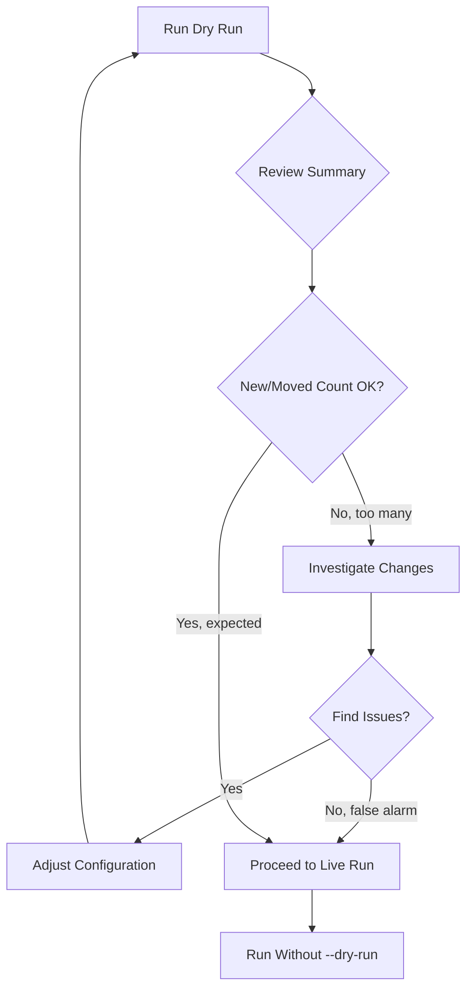

# Dry Run Mode

Preview the impact of identity resolution changes before committing to production.

---

## Why Dry Run?

!!! danger "Production Safety"
    Identity resolution changes can affect millions of records. A bad configuration could incorrectly merge unrelated entities or split valid clusters. **Always dry run first.**

Dry run mode:
- ✅ Processes all entities and builds edges
- ✅ Runs label propagation algorithm
- ✅ Computes what changes *would* happen
- ❌ **Does NOT** update production tables
- ❌ **Does NOT** update watermarks

---

## Enabling Dry Run

=== "DuckDB"

    ```bash
    python sql/duckdb/idr_run.py --db=idr.duckdb --run-mode=FULL --dry-run
    ```

=== "Snowflake"

    ```sql
    CALL idr_run('FULL', 30, TRUE);  -- 3rd parameter = dry run
    ```

=== "BigQuery"

    ```bash
    python sql/bigquery/idr_run.py --project=my-project --dry-run
    ```

=== "Databricks"

    Set widget `DRY_RUN` to `true` before running.

---

## Dry Run Output

### Console Summary

```
============================================================
DRY RUN SUMMARY (No changes committed)
============================================================
Run ID:          dry_run_e8a7b3c2
Mode:            FULL (DRY RUN)
Duration:        12s
Status:          DRY_RUN_COMPLETE

IMPACT PREVIEW:
  New Entities:      1,234
  Moved Entities:    89
  Unchanged:         45,678
  Edges Would Create: 5,432
  Largest Cluster:   523 entities

REVIEW QUERIES:
  → All changes:  SELECT * FROM idr_out.dry_run_results WHERE run_id = 'dry_run_e8a7b3c2'
  → Moved only:   SELECT * FROM idr_out.dry_run_results WHERE run_id = 'dry_run_e8a7b3c2' AND change_type = 'MOVED'
  → Summary:      SELECT * FROM idr_out.dry_run_summary WHERE run_id = 'dry_run_e8a7b3c2'

⚠️  THIS WAS A DRY RUN - NO CHANGES COMMITTED
============================================================
```

### Output Tables

Two tables are populated during dry runs:

#### dry_run_results

Per-entity change details:

| Column | Description |
|--------|-------------|
| `entity_key` | The entity identifier |
| `current_resolved_id` | Current cluster (NULL if new entity) |
| `proposed_resolved_id` | What the cluster *would* be |
| `change_type` | NEW, MOVED, or UNCHANGED |
| `current_cluster_size` | Current cluster size |
| `proposed_cluster_size` | Proposed cluster size |

#### dry_run_summary

Aggregate statistics:

| Column | Description |
|--------|-------------|
| `total_entities` | Total entities analyzed |
| `new_entities` | Entities with no previous cluster |
| `moved_entities` | Entities changing clusters |
| `unchanged_entities` | Entities staying in same cluster |
| `largest_proposed_cluster` | Size of biggest proposed cluster |

---

## Analyzing Dry Run Results

### View All Changes

```sql
SELECT 
    entity_key,
    change_type,
    current_resolved_id,
    proposed_resolved_id,
    current_cluster_size,
    proposed_cluster_size
FROM idr_out.dry_run_results
WHERE run_id = 'dry_run_e8a7b3c2'
ORDER BY change_type, entity_key;
```

### Focus on Moved Entities

**Moved entities are the most important to review** - they represent entities changing clusters.

```sql
SELECT 
    entity_key,
    current_resolved_id,
    proposed_resolved_id,
    current_cluster_size AS from_size,
    proposed_cluster_size AS to_size
FROM idr_out.dry_run_results
WHERE run_id = 'dry_run_e8a7b3c2'
  AND change_type = 'MOVED'
ORDER BY proposed_cluster_size DESC;
```

### Investigate Large Clusters

Check if any clusters are growing suspiciously large:

```sql
SELECT 
    proposed_resolved_id,
    COUNT(*) AS entity_count,
    SUM(CASE WHEN change_type = 'MOVED' THEN 1 ELSE 0 END) AS moved_in
FROM idr_out.dry_run_results
WHERE run_id = 'dry_run_e8a7b3c2'
GROUP BY proposed_resolved_id
HAVING COUNT(*) > 100
ORDER BY entity_count DESC;
```

### Compare Before/After

```sql
WITH current_state AS (
    SELECT resolved_id, COUNT(*) as current_size
    FROM idr_out.identity_resolved_membership_current
    GROUP BY resolved_id
),
proposed_state AS (
    SELECT proposed_resolved_id AS resolved_id, COUNT(*) as proposed_size
    FROM idr_out.dry_run_results
    WHERE run_id = 'dry_run_e8a7b3c2'
    GROUP BY proposed_resolved_id
)
SELECT 
    COALESCE(c.resolved_id, p.resolved_id) AS cluster,
    COALESCE(c.current_size, 0) AS current_size,
    COALESCE(p.proposed_size, 0) AS proposed_size,
    COALESCE(p.proposed_size, 0) - COALESCE(c.current_size, 0) AS change
FROM current_state c
FULL OUTER JOIN proposed_state p ON c.resolved_id = p.resolved_id
WHERE c.current_size != p.proposed_size
ORDER BY ABS(COALESCE(p.proposed_size, 0) - COALESCE(c.current_size, 0)) DESC;
```

---

## Decision Workflow



---

## Common Issues and Fixes

### Too Many Entities Moving

**Symptom:** Large number of MOVED entities unexpectedly

**Possible causes:**
1. New identifier type added that broadly matches
2. max_group_size too high

**Fix:**
```sql
-- Check which identifier types are causing merges
SELECT 
    d.proposed_resolved_id,
    COUNT(DISTINCT d.entity_key) as entities,
    array_agg(DISTINCT i.identifier_type) as identifier_types
FROM idr_out.dry_run_results d
JOIN idr_work.edges_new e ON d.entity_key = e.entity_a OR d.entity_key = e.entity_b
JOIN idr_work.identifiers i ON i.entity_key = d.entity_key
WHERE d.run_id = 'dry_run_xxx' AND d.change_type = 'MOVED'
GROUP BY d.proposed_resolved_id
ORDER BY entities DESC;
```

### Giant Cluster Forming

**Symptom:** One cluster with thousands of entities

**Fix:**
1. Check for generic identifiers (test@test.com, 0000000000)
2. Add to exclusion list
3. Lower max_group_size for the identifier type

```sql
-- Find the culprit identifier
SELECT identifier_type, identifier_value_norm, COUNT(*) as matches
FROM idr_work.identifiers
WHERE identifier_value_norm IN (
    SELECT identifier_value_norm 
    FROM idr_work.identifiers 
    GROUP BY identifier_value_norm 
    HAVING COUNT(*) > 1000
)
GROUP BY identifier_type, identifier_value_norm
ORDER BY matches DESC;
```

---

## Retention and Cleanup

Dry run results are retained based on configuration:

```sql
-- Check retention setting
SELECT config_value FROM idr_meta.config 
WHERE config_key = 'dry_run_retention_days';

-- Update retention (default: 7 days)
UPDATE idr_meta.config 
SET config_value = '14' 
WHERE config_key = 'dry_run_retention_days';
```

Manual cleanup:
```sql
DELETE FROM idr_out.dry_run_results 
WHERE created_at < CURRENT_TIMESTAMP - INTERVAL '7 days';

DELETE FROM idr_out.dry_run_summary 
WHERE created_at < CURRENT_TIMESTAMP - INTERVAL '7 days';
```

---

## Best Practices

1. **Always dry run before production** - Especially for first runs or configuration changes
2. **Review MOVED entities** - These are the most likely to indicate issues
3. **Check large clusters** - Investigate any cluster growing beyond expectations
4. **Keep dry run history** - Useful for debugging later issues
5. **Automate dry run validation** - Add assertions in CI/CD

---

## Next Steps

- [Production Hardening](production-hardening.md) - max_group_size, exclusions
- [Metrics & Monitoring](metrics-monitoring.md) - Track dry run metrics
- [Troubleshooting](troubleshooting.md) - Common issues
