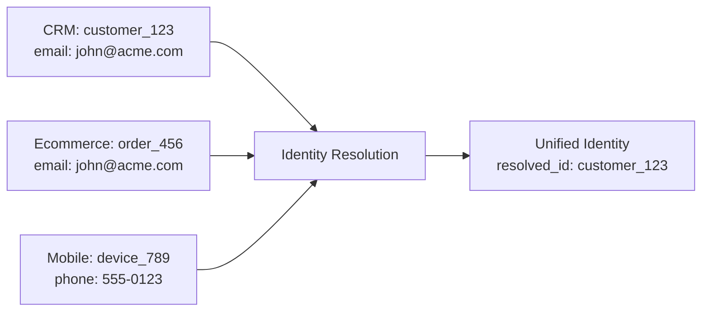
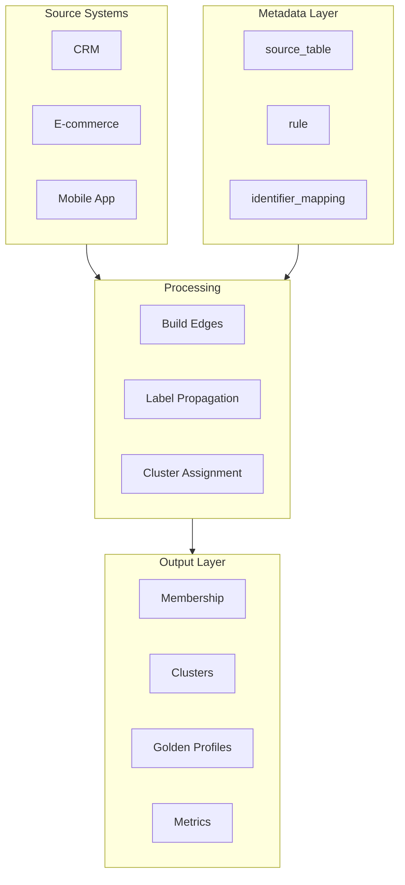

# SQL Identity Resolution

**Production-grade deterministic identity resolution for modern data warehouses.**

<div class="grid cards" markdown>

-   :material-database:{ .lg .middle } **Multi-Platform**

    ---

    Run on DuckDB, Snowflake, BigQuery, or Databricks with the same logic.

    [:octicons-arrow-right-24: Platform Setup](getting-started/platforms/duckdb.md)

-   :material-speedometer:{ .lg .middle } **Production Ready**

    ---

    Dry run mode, metrics export, audit logging, and data quality controls.

    [:octicons-arrow-right-24: Production Guide](guides/production-hardening.md)

-   :material-code-tags:{ .lg .middle } **SQL-First**

    ---

    Pure SQL execution—no Python runtime needed in production.

    [:octicons-arrow-right-24: Architecture](concepts/architecture.md)

-   :material-lock-open:{ .lg .middle } **Open Source**

    ---

    Full control, full transparency, zero licensing costs.

    [:octicons-arrow-right-24: GitHub](https://github.com/anilkulkarni87/sql-identity-resolution)

</div>

---

## What is Identity Resolution?

Identity resolution is the process of matching and merging records across multiple data sources to create a unified view of each entity (customer, user, account). 

This solution uses **deterministic matching** with **label propagation** to create stable, explainable identity clusters.



---

## Quick Start

=== "DuckDB"

    ```bash
    # Clone and setup
    git clone https://github.com/anilkulkarni87/sql-identity-resolution.git
    cd sql-identity-resolution
    
    # Create schema
    duckdb idr.duckdb < sql/duckdb/00_ddl_all.sql
    
    # Run (dry run first!)
    python sql/duckdb/idr_run.py --db=idr.duckdb --run-mode=FULL --dry-run
    ```

=== "Snowflake"

    ```sql
    -- Create schemas and tables
    -- Run sql/snowflake/00_ddl_all.sql
    
    -- Execute (dry run first!)
    CALL idr_run('FULL', 30, TRUE);  -- TRUE = dry run
    ```

=== "BigQuery"

    ```bash
    # Setup
    export GOOGLE_APPLICATION_CREDENTIALS=/path/to/sa.json
    
    # Create schema
    bq query < sql/bigquery/00_ddl_all.sql
    
    # Run (dry run first!)
    python sql/bigquery/idr_run.py --project=my-project --dry-run
    ```

=== "Databricks"

    ```python
    # Import notebooks from sql/databricks/notebooks/
    # Run IDR_QuickStart.py to setup
    # Set DRY_RUN widget to "true" for preview
    ```

[:octicons-arrow-right-24: Full Quick Start Guide](getting-started/quickstart.md)

---

## Key Features

| Feature | Description |
|---------|-------------|
| **Deterministic Matching** | Rule-based matching on email, phone, loyalty ID, etc. |
| **Label Propagation** | Graph-based clustering using connected components |
| **Incremental Processing** | Watermark-based delta processing |
| **Dry Run Mode** | Preview changes before committing |
| **Metrics Export** | Prometheus, DataDog, webhook integrations |
| **Production Hardening** | Max group size limits, identifier exclusions |
| **Golden Profiles** | Automatic best-record selection |

---

## Architecture Overview



[:octicons-arrow-right-24: Full Architecture](concepts/architecture.md)

---

## Next Steps

<div class="grid cards" markdown>

-   :material-rocket-launch: [**Quick Start**](getting-started/quickstart.md)

    Get running in 5 minutes

-   :material-cog: [**Configuration**](guides/configuration.md)

    Set up rules and sources

-   :material-test-tube: [**Dry Run Mode**](guides/dry-run-mode.md)

    Preview changes safely

-   :material-chart-line: [**Metrics**](guides/metrics-monitoring.md)

    Monitor your pipeline

</div>
